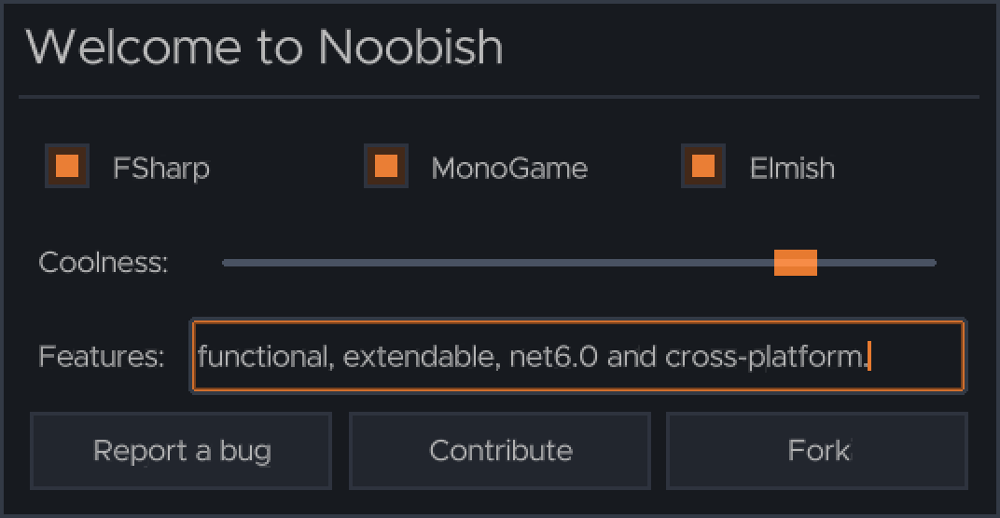

# Noobish

## Introduction



Noobish is an experimental element tree / ui library for MonoGame written with F#. Noobish supports multiple basic components and limited customization through themes and custom components. Noobish uses non-complex (one stretch) Nine Patches for component images. Noobish takes inspiration from Elmish, but there is no connection to it. Noobish can be used with mobile devices.

Since Noobish is initially designed for Elmish, the element tree is rebuilt on each *'view'* call. Noobish persists state of elements between view cycles to keep state stuch as scroll position.

## Supported components

* **h1**, **h2**, **h3** represent headers of varying sizes.
* **label** is the basic visualization of short single-line text.
* **p** renders wrapped multiline text.
* **scroll** enables scrolling of the overflowing content.
* **textbox** captures user key input.
* **button** provides something for the users to click on.
* **combobox** allows selecting a value from a dropdown.
* **checkbox** is a toggleable selection with a text.
* **hr** is a nice line to divide content.
* **div** and **panel** provide a simple block layout.
* **grid** creates a complex layout.

## Attributes

* ToDo

## Markup

Noobish views are built as code with a DSL. Each view is a list of NoobishElements.

```fsharp
ui.Grid(10, 8)
    |> ui.SetChildren [|
        ui.Space() 
            |> ui.SetColspan 10
            |> ui.SetRowspan 2
        ui.Space() 
            |> ui.SetColspan 2
            |> ui.SetRowspan 4
        ui.PanelVertical()
            |> ui.SetColspan 6
            |> ui.SetRowspan 4
            |> ui.SetChildren [|
                ui.Header "Welcome to Noobish" |> ui.AlignTextCenter
                ui.HorizontalRule()
                ui.Grid (6, 4)
                    |> ui.SetChildren [|
                        ui.Checkbox "FSharp" true ignore |> ui.SetColspan 2 
                        ui.Checkbox "MonoGame" true ignore |> ui.SetColspan 2
                        ui.Checkbox "Elmish" true ignore |> ui.SetColspan 2
                        ui.Label "Coolness:"
                            |> ui.SetTextAlign NoobishAlignment.Left 
                            |> ui.SetFill
                        ui.Slider (0f, 100f) 1f 80f ignore 
                            |> ui.SetFillHorizontal
                            |> ui.SetColspan 5
                        ui.Label "Features:"
                            |> ui.SetTextAlign NoobishAlignment.Left 
                            |> ui.SetFill
                        ui.Textbox model.FeatureText (fun v -> dispatch (FeaturesChanged v))
                            |> ui.SetFillHorizontal
                            |> ui.AlignTextLeft
                            |> ui.SetColspan 5
                        ui.Button "Report a bug" (fun _ _ -> ())
                            |> ui.AlignTextCenter
                            |> ui.SetFillHorizontal
                            |> ui.SetColspan 2
                        ui.Button "Contribute" (fun _ _ -> ()) 
                            |> ui.AlignTextCenter
                            |> ui.SetFillHorizontal
                            |> ui.SetColspan 2
                        ui.Button "Fork" (fun _ _ -> ()) 
                            |> ui.AlignTextCenter
                            |> ui.SetFillHorizontal
                            |> ui.SetColspan 2


                    |]

            |]
    |]
```

## Style Sheets

Noobish style sheets are json files. The styles cascade towards *'default'*.

```json
{
    "TextureAtlas": "Dark/DarkAtlas.json",
    "Styles": {
        "Default": {
            "default": {
                "font": "Metropolis-Regular",
                "fontSize": 12,
                "fontColor": "bbbbbbFF",
                "padding": [4, 4, 4, 4],
                "margin": [4, 4, 4, 4],
                "color": "39404dff"
            }
        },
        "Button": {
            "default": {
                "textAlign": "center",
                "drawables": [
                    ["button-default.9"]
                ]
            },
            "toggled": {
                "color": "4b692fff"
            }
        }
    }
}
```

## Scaling

Noobish does not support scaling due to issues with texture bleeding and nine patches. The recommended approach is to render to an offscreen buffer (MonoGame RenderTarget) and scale it to desired scale.

## Project setup

From your main project, add reference to Noobish.dll.

In your content pipeline, add reference to

* Noobish.PipelineExtension.

Best way to start is to copy over a theme and a font from the demo project and start from there.

## Generating Fonts

Fonts are generated using msdf-atlas-gen.

## Project Layout

* *Noobish:* The library project consumed by the user.
* *Noobish.Test:* The tests of the library.
* *Noobish.Demo:* Executable demo.
* *Noobish.Demo.Content:* Content project for the Noobish.Demo.
* *Noobish.PipelineExtension:* MonoGame Content Pipeline Extension that creates TextureAtlases and StyleSheet.

## Limitations

Noobish tracks identity of a component by its location. Noobish doesn't handle properly layouts where components disappear from the layout between view calls.

## ToDo

* Textbox:
  * double click to clear and focus.
  * Three places for Text: Element, ElementState Model, Element Model.
* Memoize support.
* API stabilization.
